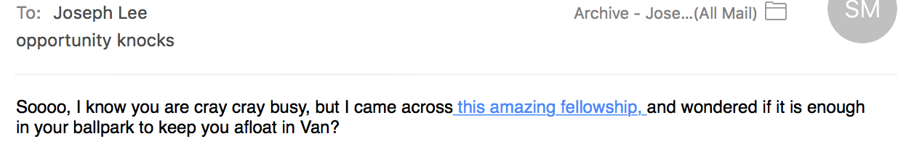
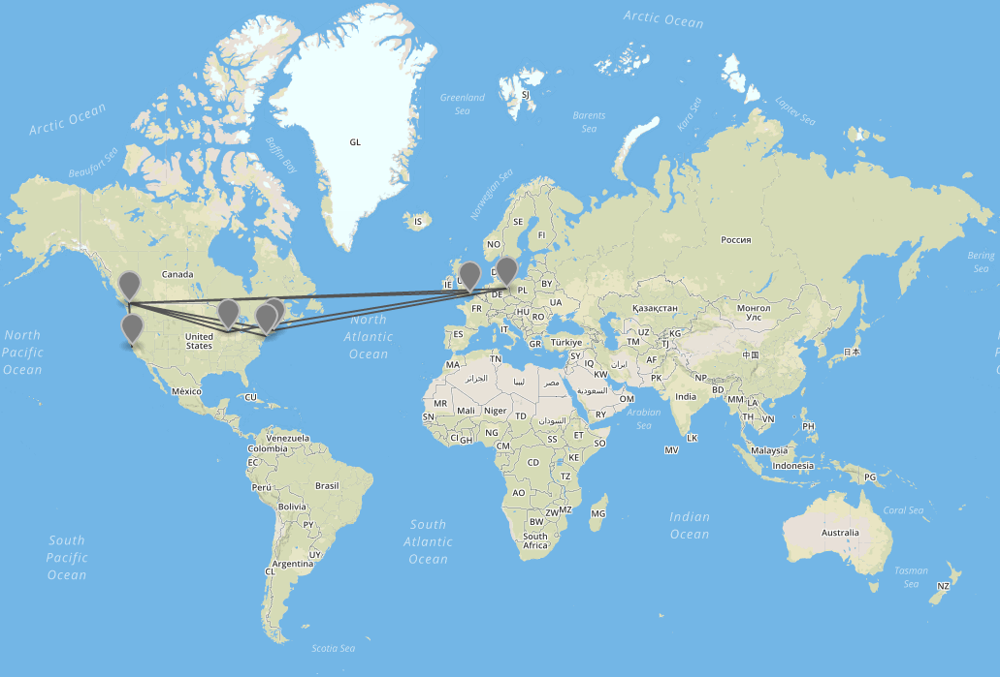
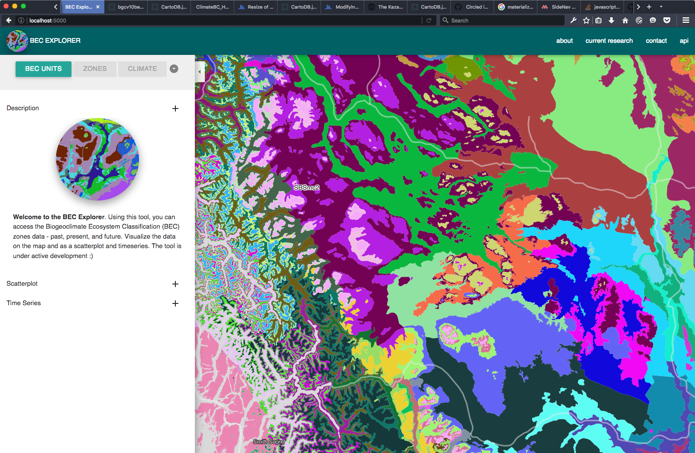

# Open science starts with you!

 

  

Around this time last June (2015), my friend Sarah sent me this email with the subject: "Opportunity Knocks". In the body of the email was the link to the Mozilla Science Lab's **Call for Open Science Fellows**. At the time, I had never heard of the Mozilla Science Lab and only had a vague understanding of what it meant to do "open science". It turned out that these two things - the Mozilla Science Lab and open science - would **fundamentally change my life** over the following 10 months in ways that I could not have imagined or expected based on the description of the fellowship program webpage ( this appears to be a common theme with a fellowship with Mozilla; see: [1](http://briantjacobs.com/john-cusack-on-becoming-a-2015-knight-mozilla-fellow/),[2](http://harloholm.es/2014/07/29/a-rare-opportunity-to-reflect.html),[3](http://veltman.tumblr.com/post/94827905007/opennews-t-minus-36-hours),[4](https://aureliamoser.com/2014/08/05/parallax-effects-modern-map-moving-in-interactive-news/)). Looking back, Sarah's email may have been the most important one I've ever received. 

With the next round of [Open Science Fellowship applications now open - deadline July 15th](https://science.mozilla.org/programs/fellowships), **I hope I can motivate and inspire you to apply** by sharing some of my experiences below.

Every fellowship will manifest differently depending on the institution you're based at, whether you're pursuing your studies or working as a researcher, if you have defined open science project or not, and what skills you're looking to share and develop throughout the course of the fellowship. Basically, **you get to choose your own adventure**. 

During my fellowship, I was based at the University of British Columbia in **Vancouver, BC** where I was also doing a master's program researching how to [map greenhouse gas emissions in cities](http://joeyklee.github.io/presentations/ICUC-JLEE-2015/#/) (yes, all you environmental scientists and map makers should apply!).

Since I was in the middle of my master's research, being a Open Science Fellow meant that I was balancing my various research projects while also working towards my Fellowship goals. Ultimately this meant 20% of my time went towards "thesising" and finishing up a [Kickstarter project](https://www.kickstarter.com/projects/357538735/aerial-bold-kickstart-the-planetary-search-for-let) and the other 80% towards my open science projects and the various fellowship activities. Suffice it to say, **my thesis got done** - I even managed to submit it to an open access journal for review (fingers crossed!) - and the Kickstarter project was [launched](http://type.aerial-bold.com/tw/). If you're worried about finding the right time balance, rest assured that the **Mozilla Science Lab team** - who you will come to know quite well - **will work with you to make your fellowship happen**. **They are the best**.

 

  
For me, the fellowship is very simply about **making friends**. Starting with the [fellowship onboarding](http://jk-lee.com/onboarding-in-nyc/)in New York City and [MozFest](https://2015.mozillafestival.org/) in London, I realized that the fundamental building block of open science (and open source, open journalism, open data, etc) is rooted in the development of **strongly knit communities**. Despite all the grand visions I had for the fellowship, the most valuable thing I will takeaway are the connections I've made with the people who care most about growing the open science/source community. By having the opportunity to participate in events like Mozfest, to attend conferences like [RightsCon](http://jk-lee.com/rightscon-san-francisco/) and [OpenVis Conf](https://openvisconf.com/), and to organize and facilitate events like the [Open Working Workshop](http://jk-lee.com/working-open-workshop-and-workweek/), I have been able to **interact and work with the best, the brightest, and some of the most well connected people** in my local community and in the world. Through these friendships, I've started new collaborations, turned many ideas into actions, and had the chance to learn new skills (both technical and social) and **new ways of seeing**.

 

  

Making friends takes work, of course and Mozilla Science fosters these relationships on the web and in person. Along with the myriad of Skype meetings, Gitter Chats, Tweets, emails, Etherpads, Github repositories, and Vidyo Chats, the fellows get to **jet-set across the globe** for various conferences, workweeks, workshops, and more. Over the last 8 months, I've traveled **over 70,000 km** (43,000 mi) and there's still more to come. Despite the many communication channels of the web, nothing can replace the dozens of opportunities to meet new people in (un)familiar places. If you can take advantage of these opportunities, you most certainly won't regret it.

 

  

When I started the fellowship, I had a vague set of skills that included some early semblance of programming, design, curriculum development, and teaching - skills which I had picked up mostly throughout the course of my master's. For me, it was important that as an Open Science Fellow, I could build upon these existing skills by making projects that would give me the **opportunity to work with others** and **learn from my mistakes**. 

 

  

I therefore had set out as a priority to build my fellowship around projects that would help me to work on open science projects while at the same time taking the time to try new things. Through projects like the [BEC Explorer](https://github.com/joeyklee/bec-explorer), [THIMMI](https://github.com/ubc-micromet/TIHMMI), and the [Prof-cli-geo](https://github.com/joeyklee/prof-cli-geo) projects, I was able to bake into the fellowship a little bit of everything - **science communication and collaboration, web design/development, and education**. To make this happen, my fellowship was designed around [Sprints](http://jk-lee.com/entering-sprint-land/) which are intensive 1-2 week jams where my collaborators and I would focus on one project (a luxury in my experience) and try to get as far on a project as possible. The main goal being to get a project up to a stage to prove a concept or set the stage for further development.

 

 
Apart from the learnings gained from those projects, working with the Mozilla Science Lab Staff has helped me to **develop a whole new knowledge base centered around teaching and facilitation tools and methods** at a level I had never experienced before. Given that the expertise in the Lab ranges from open data to licensing to user experience design, every project and every event becomes an opportunity to practice a new ways of **increasing the accessibilty, inclusivity, and diversity within and between the sciences**. I think [Harlo from the open news fellows cohort](http://harloholm.es/2014/07/29/a-rare-opportunity-to-reflect.html) summed it up quite well, commenting on what it's like to have so many resources and talented people at your finger tips: "**You'll feel like Charlie in the Chocolate Factory**". 

 

 

Making science "more open" however is something that I had to define for myself and for my fellowship. Perhaps the hardest part of the fellowship, yet the most rewarding, was being able to** define my own projects, set my own goals, and find the ways to make them happen** - all while earning [great financial support](https://science.mozilla.org/programs/fellowships). Whether it was creating workshops and educational materials to teach things like Git/Github or Commandline tools or working on building web applications with colleagues, **my fellowship was about discovering how to use and develop my skills to benefit the community of students, researchers, and educators around me**. 

I hope you too will take the chance to do good for science while making friends along the way.

  

<h2>The deadline is July 15th!  <a href="https://science.mozilla.org/programs/fellowships">Apply now </a> </h2>

